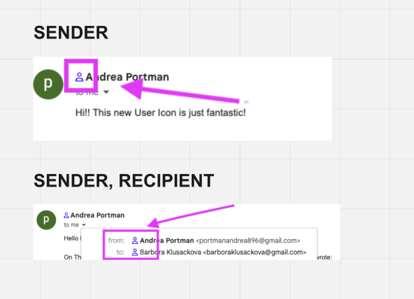

# LinkedIn Lookup in Gmail

To use this script you need the [Tampermonkey Extension](https://chrome.google.com/webstore/detail/tampermonkey/dhdgffkkebhmkfjojejmpbldmpobfkfo).

## Installation

Open the following [script](https://github.com/kbarushkaa/tampermonkey-linkedin-lookup/raw/main/linkedin-lookup.user.js) and click select _Install_.

## Usage

Open an email in Gmail, you can see User icon positioned next to the sender's and recepient's name.

User icon - searches LinkedIn by recipient's name.

## Features

1. **Adding User icon to sender and recipient**  
   The icon is added to the email's sender and email's recipient(s).
